# Trabajo Práctico 0 - Git

En este pequeño TP vamos a explorar brevemente el uso de **git**. La idea es establecer una base mínima común de conocimiento de git para el uso que le damos en la materia.

**git** es una herramienta muy versátil y poderosa, que se puede adaptar a una gran cantidad de escenarios y flujos de trabajo.
Por esta razón, en una primera mirada nos puede parecer abrumador el número de comandos y variantes que brinda,
pero trataremos de restringirnos a los casos de uso más comunes y al _workflow_ que usaremos en la materia.

A modo de pantallazo general, git nos va a permitir:
- Tener un _repositorio_ remoto, alojado en los servidores de github, donde guardar y compartir el progreso en nuestro proyecto.
- Tener una copia _local_ en nuestra PC donde correr el código, hacer cambios, y cuando están listos reflejarlos en la copia remota con solo un comando.
- Marcar puntos de guardado (_commits_) que nos permitan volver a un estado anterior del proyecto o consultar fácilmente qué cambió desde un punto anterior, en caso de encontrarnos con problemas o querer revertir cambios.

Si ya creaste tu fork del repositorio y clonaste localmente, podés saltar directamente al [ejercicio](#excercises).

## Introducción

¿Qué es git? Citando a [su documentación](https://git-scm.com/):

> Git es un sistema de **control de versiones** gratuito y de código abierto, diseñado para manejar proyectos de cualquier tamaño de manera veloz y eficiente.

> ¿Qué es un control de versiones? Un control de versiones es un sistema que **registra los cambios realizados en un archivo o conjunto de archivos a lo largo del tiempo**, de modo que puedas recuperar versiones específicas más adelante.

> La principal diferencia entre Git y cualquier otro VCS es la forma en la que manejan sus datos. Conceptualmente, la mayoría de los otros sistemas almacenan la información como una lista de cambios en los archivos.
> Git maneja sus datos como un **conjunto de copias instantáneas en un filesystem mínimo**. Cada vez que confirmas un cambio, o guardas el estado de tu proyecto en Git, él básicamente toma una foto del aspecto de todos tus archivos en ese momento y guarda una referencia a esa copia instantánea. Para ser eficiente, si los archivos no se han modificado Git no almacena el archivo de nuevo, sino un enlace al archivo anterior idéntico que ya tiene almacenado. 

> **La mayoría de las operaciones en Git sólo necesitan archivos y recursos locales** para funcionar. Por ejemplo, (...) si quieres ver los cambios introducidos en un archivo entre la versión actual y la de hace un mes, Git puede buscar el archivo de hace un mes y hacer un cálculo de diferencias localmente, en lugar de tener que pedirle a un servidor remoto que lo haga, u obtener una versión antigua desde la red y hacerlo de manera local. 

> Esto significa que hay muy poco que no puedes hacer si estás desconectado o sin VPN. Si te subes a un avión o a un tren y quieres trabajar un poco, puedes confirmar tus cambios felizmente hasta que consigas una conexión de red para subirlos. 

Debido a su popularidad, se dispone de una cantidad enorme de tutoriales y guías de uso. Recomendamos algunas que nos parecieron interesantes en la sección [Referencias](#ref).

Supondremos a lo largo del taller una instalación de Linux, de tipo Ubuntu/Debian. Si instalaste alguna distribución basado en otro sistema (Arch, Fedora), entonces entendemos que _sabes de qué va la cosa_. Si sos usuario/a de Windows, existe una herramienta llamada WSL que nos permite contar con una instalación y consola de Linux que pueden utilizar para los trabajos de la materia, les dejamos un link con instrucciones básicas de instalación y uso: https://learn.microsoft.com/es-es/windows/wsl/install. Desde la materia les recomendamos fuertemente tomar la oportunidad para procurar una instalación de Linux; pueden acercarse durante los laboratorios si tienen algún problema creando el dual boot.

El listado de temas que vamos a explorar abarca los siguientes:

- [Instalación y configuración](#installation)
- [Forkeando el repo](#forking)
- [Clonando el repo](#cloning)
- [Aplicar cambios locales al repositorio remoto](#push)
- [Referencias](#ref)

<h2 id="installation">Instalación y configuración</h2>

Para instalar **git** en una distribución Debian/Ubuntu simplemente debemos hacer:

```shell
$ sudo apt install git
```

Podemos comprobar que ha sido instalado correctamente, haciendo

```shell
$ git --version
```

En cuanto a la configuración, debemos indicarle a git nuestro nombre y mail para que pueda firmar los commits
cada vez que hagamos uno. Si estamos utilizando una computadora propia (no de los laboratorios), podemos correr ahora:

```shell
$ git config --global user.name <su nombre>
$ git config --global user.email <su email>
```

Pasando el parámetro `--global` aplicamos la configuración para nuestro usuario, con lo cual quedará configurado con estos parámetros para todos los repos nuevos que creemos.

> [!WARNING]
> En las computadoras de los laboratorios, pueden correr estos comandos sin la opción --global cuando estén parados dentro del clon de su repo (más adelante) para que no quede configurado su nombre y mail para el resto de los estudiantes que usen la PC.


<h2 id="forking">Forkeando el repo</h2>

Por cada guía de trabajos prácticos vamos a compartirles un repositorio público en github. Ustedes no tendrán permisos para trabajar en estos repositorios, por lo que vamos a empezar generando una copia propia del repositorio en cuestión sobre la que puedan trabajar libremente. Esto se conoce como "hacer un fork" del repositorio original. 

En principio, para hacer un fork: 

1. Presionamos el botón que se indica en la siguiente imagen:

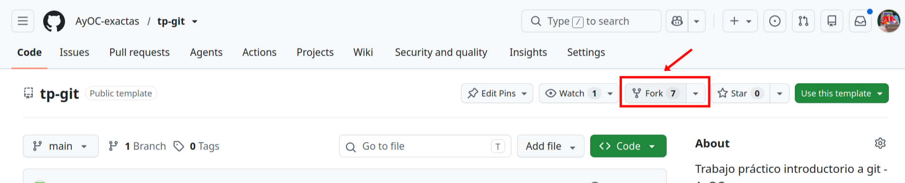

2. Configuramos el fork, eligiendo el _owner_ del proyecto (usualmente su mismo usuario) y nombre del repositorio. Para los tps de esta materia, basta con copiar solo la branch `main`. 

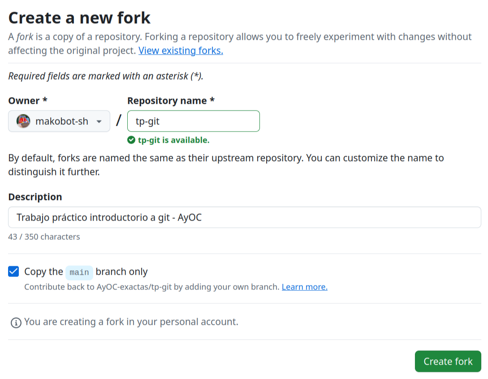

3. Presionamos `Create fork`. Cuando la copia esté lista, github nos llevará a la página de nuestro fork - podemos comprobarlo mirando el nombre que figura al costado del nombre del repositorio:

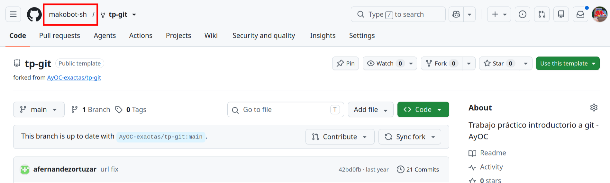

<h2 id="cloning">Clonando el repo</h2>

Con git instalado y el fork creado, podemos clonar nuestro fork del TP a nuestra PC. De esta manera, podremos trabajar localmente sobre el repositorio local e ir sincronizando los cambios al repositorio remoto (en este caso alojado en **github.com**), a medida que lo creamos necesario.

Hay tres formas de clonar un repositorio:

- Utilizando la url que comienza con *https://github.com/AyOC-exactas/*
- Por SSH
- Por Github CLI

Si clonamos utilizando la primera opción, tendremos que autenticarnos con usuario y Personal Access Token o PAT (su configuración se explica en el próximo apartado) cada vez que hagamos alguna operación con el servidor remoto desde nuestra PC. Esta es la opción más segura en computadoras compartidas, pero se torna molesta rápidamente. Nuestras recomendaciones son las siguientes:

- **En su computadora personal** hoy en día hay dos opciones:
    - Sin necesidad de instalaciones extra, configurar acceso por _SSH_ (existen otras opciones equivalentes como configurar un administrador de credenciales). Para configurar una clave ssh pueden seguir los pasos que están en el siguiente [link](https://docs.github.com/en/authentication/connecting-to-github-with-ssh). Los pasos claves son "Generate an SSH key pair" y "Add an SSH key to your GitLab account".
    - Instalar la [Github CLI](https://cli.github.com/) y ejecutar `gh auth login`, que les permitirá autenticarse en el navegador y ofrecerá crear y asociar automáticamente una clave SSH a su cuenta.
- **En las computadoras de los laboratorios**, donde varias personas utilizan el mismo usuario y posiblemente ustedes cambien de computadoras entre clases, recomendamos configurar acceso mediante HTTPS + PAT. Si realmente desean utilizar SSH es posible [configurar múltiples claves](https://stackoverflow.com/questions/2419566/best-way-to-use-multiple-ssh-private-keys-on-one-client/38454037#38454037) para el mismo sitio, pero tengan en cuenta que tendrán que hacerlo en cada computadora que quieran usar, y que **deben** asociar una contraseña a la clave para evitar que otros usuarios realicen operaciones en su nombre.

### Configurando acceso HTTPS mediante PAT

Para acceder mediante HTTPS a github es necesario crear un Personal Access Token (PAT). Estos tokens funcionan como contraseñas temporales, con vencimiento y scope más reducido que una contraseña (podemos darle permiso solo de lectura, por ejemplo).

Para crearlo debemos ingresar a las preferencias de github e ir a la última opción del menú: [`Developer Settings` (Configuraciones de desarrollo)](https://github.com/settings/apps).

En la página de configuraciones de desarrollo, seleccionamos el menú de Personal access tokens, submenú `Tokens (classic)`.

Nos aparecerá un botón para generar un nuevo token, `Generate new token` que abrirá un desplegable. **Recomendamos elegir `Generate new token (classic)`** ya que es considerablemente más sencillo de configurar.

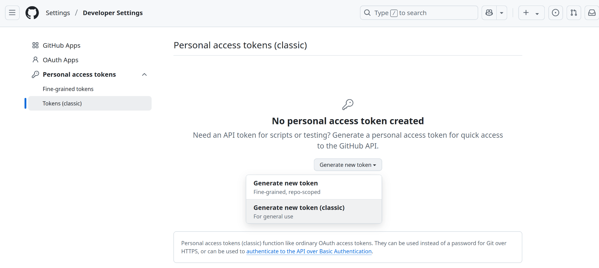

En la página resultante, basta con seleccionar el scope `repo`.
Pueden colocar la nota que deseen como "nombre" del PAT.
Para mayor seguridad, pueden dar una expiración de un día al PAT de manera que su vencimiento sea cercano al fin de la clase. De todos modos, github no debería estar guardando su PAT en la computadora en ningún momento. Además **pueden revocar los PAT generados en cualquier momento**. Si por algún motivo creen que su access token fue comprometido, podrán darlo de baja en esta misma página.

Terminadas las configuraciones, seleccionamos `Generate token` para generar el PAT.

> [!WARNING]
> **:warning: sólo se mostrará el PAT generado una vez**
> así que este es el momento de guardarlo en algún lugar accesible pero seguro.

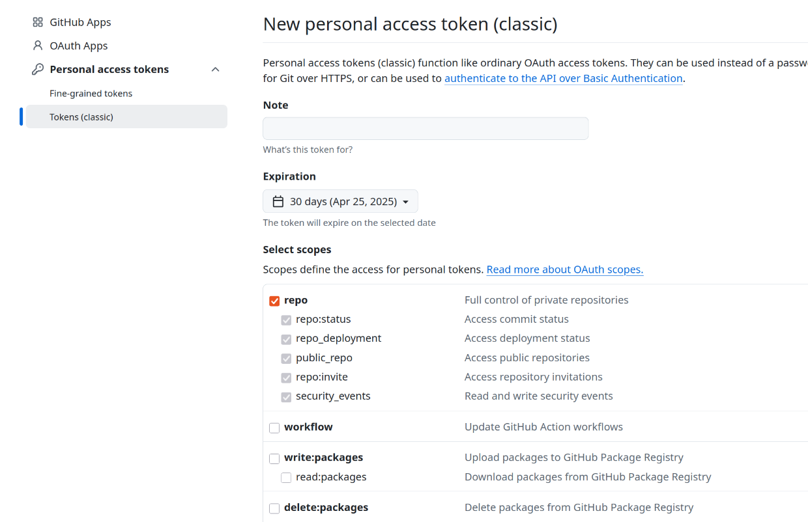

Creado el PAT, nos figurará en la página anterior

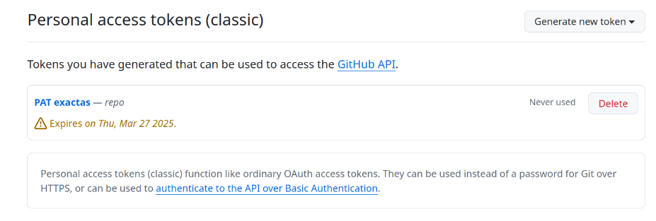

Y ahora podemos clonar el repositorio desde la línea de comandos.

### Clonando el repositorio con los accesos configurados

> [!NOTE]
> A partir de este punto, todas las operaciones que realicen serán sobre **su fork del repositorio**. Tengan abierta la página de su fork en el navegador. Pueden comprobar si están en su fork revisando que figure su nombre de usuario al costado del nombre del repositorio, como se muestra al final de la sección [Forkeando el repo](#forking).

Una vez configurado nuestro PAT, clave SSH (se puede [probar la clave SSH](https://docs.github.com/en/authentication/connecting-to-github-with-ssh/testing-your-ssh-connection)!) o Github CLI, vamos a usar la dirección del dropdown `clone` correspondiente al tipo de acceso que elegimos. Por ejemplo, si estamos usando SSH, usaremos la dirección que comienza con **git@github.com** para clonar el repositorio:

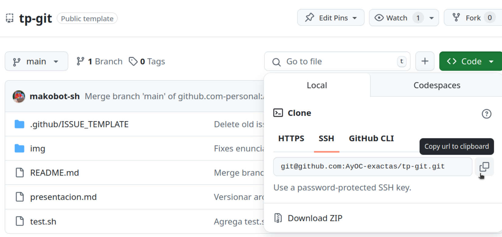

Para clonar el repositorio con Github CLI, en lugar de una URL se mostrará un comando - basta con copiarlo y ejecutarlo en la terminal. El comando tendrá esta pinta: `gh repo clone ejemplo/tp-git`.

Para clonar el repositorio tanto con HTTPS como con SSH las instrucciones son las mismas: abrimos una terminal, hacemos `cd` al directorio en el cual querramos guardar la copia local del repositorio y ejecutamos

```shell
$ git clone <url de clonado>
```

Donde la url es la que nos da el dropdown `clone` del repositorio en github. Según el caso:

- Si estamos usando SSH, la url tendrá esta pinta: `git@github.com:ejemplo/tp-git`. Al usar SSH, la autenticación es automática.
- De elegir usar HTTPS, la url tendrá esta pinta: `https://github.com/ejemplo/tp-git`. En ese caso se nos solicitará ingresar el usuario (presionar enter) y contraseña (en este momento se puede pegar el PAT a la terminal presionando `ctrl + shift + v` - NO se imprimirá en pantalla la contraseña, hay que confiar y presionar enter e intentar de nuevo si no funcionó).

Si todo salió bien, deberíamos ver algo parecido a lo siguiente:

```shell
Cloning into 'tp-git'...
remote: Enumerating objects: 24, done.
remote: Counting objects: 100% (24/24), done.
remote: Compressing objects: 100% (19/19), done.
remote: Total 24 (delta 0), reused 24 (delta 0), pack-reused 0
Receiving objects: 100% (24/24), 303.16 KiB | 192.00 KiB/s, done.
```

y aparecerá un subdirectorio con el nombre de nuestro repositorio. En este ejemplo, se llamará **tp-git**.

> [!NOTE]
> Si están trabajando en computadoras del laboratorio, este es el momento de configurar su usuario y correo en el repositorio. Primero hagan `cd` al directorio del fork, y luego ejecuten:
```shell
$ git config user.name <su nombre>
$ git config user.email <su email>
```

Les recomendamos usar el editor de texto VSCode [vscode](https://code.visualstudio.com/) en el que pueden descargar varias extensiones utiles manejar repositorios de git.
Nostros recomendamos [git-graph](https://marketplace.visualstudio.com/items?itemName=mhutchie.git-graph) la cual pueden instalar de dos maneras:

1. Desde el marketplace
2. Haciendo Ctrl + P (Quick Open) y luego:

```shell
ext install mhutchie.git-graph
```

Para acceder al gráfico de git:

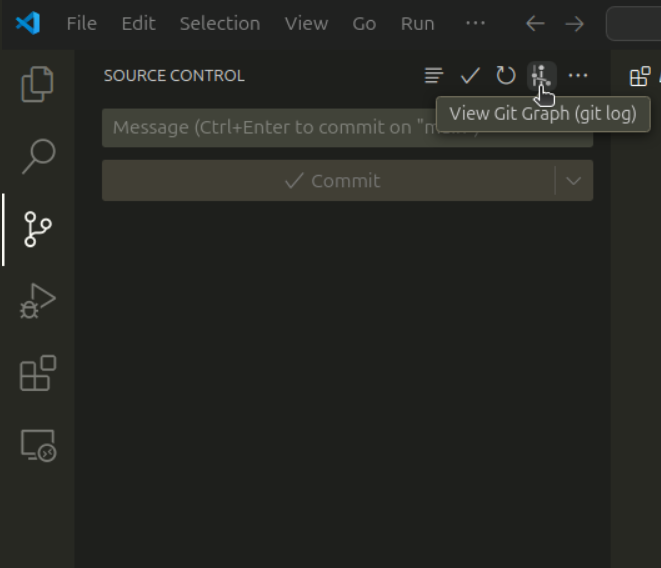

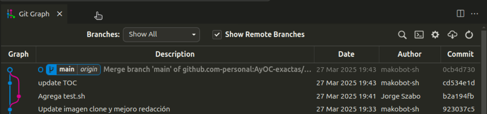

<h3 id="push">Aplicar cambios locales al repositorio remoto</h3>

Cualquier modificación que realicemos en el directorio solo afectará el estado del repositorio local (que se encuentra alojado en el directorio oculto **.git**). Más adelante veremos como reflejar los cambios en el servidor remoto mediante la acción `push`.

Procuren siempre realizar un `pull` del repositorio antes de sentarse a trabajar. 
La acción pull hace que **el repositorio local se actualice con las modificaciones que haya en el remoto**. 

Este TP es individual, pero si alguien más realizara un push al repositorio remoto luego de la última vez que hicieron pull, podrían aparecer conflictos entre los cambios remotos y sus cambios locales. En la próxima sección dejamos algunas referencias de material complementario para que puedan profundizar cuando lo necesiten y resolver situaciones no cubiertas en esta guía.

> [!NOTE]
> Otra extensión util que pueden revisar para realizar acciones de git más complejas de manera visual es [Gitlens](https://marketplace.visualstudio.com/items?itemName=eamodio.gitlens).
>
> Pueden instalarla
> 1. Desde el marketplace buscando `Gitlens`
> 2. Haciendo Ctrl + P (Quick Open) y luego:
> ```shell
> ext install eamodio.gitlens
> ```

<h2 id="ref">Referencias</h3>

- [El tutorial de atlassian, que es excelente](https://www.atlassian.com/es/git/tutorials)
- [EL libro](https://git-scm.com/book/es/v2)
- [git guide](http://rogerdudler.github.io/git-guide/)
- [Demo interactiva](https://learngitbranching.js.org/)
- [Otra demo interactiva](https://onlywei.github.io/explain-git-with-d3/)

<h2 id="excercises">Ejercicio: Modificar un archivo y crear un commit</h2>

### Branches (ramas)
En GitHub contamos con **branches (ramas)**, que son una versión paralela del repositorio, para tener separado el trabajo que no está listo para incluir en el proyecto finalizado (ya sea porque esta en construcción o porque estamos haciendo experimentos que no queremos queden reflejados).
En general, se intenta que el trabajo presente en la rama principal `main` sea código funcional, y que cada _feature_ que vamos encarando (o bug que vamos a arreglar) lo trabajemos en una branch que no será ''aplicada'' a main hasta que el feature no esté en un estado funcional.
De esta manera, evitamos afectar el proyecto principal con desarrollos a medio terminar.

Dado que las guías de ejercicios son individuales, y que cada uno trabajará en su propio fork, probablemente no necesiten trabajar con ramas en esta materia - bastará con que realicen commits directamente a `main`. No obstante, son una herramienta fundamental al momento de trabajar de forma colaborativa en un mismo repositorio. Les acercamos la documentación oficial de ramas para que puedan consultarla en caso de necesitarla: ["Acerca de las Ramas (branches)"](https://docs.github.com/es/pull-requests/collaborating-with-pull-requests/proposing-changes-to-your-work-with-pull-requests/about-branches).

### Ejercicio

En este ejercicio introduciremos una modificación en nuestro fork y crearemos un commit con los nuevos cambios.
Un **commit** es un conjunto de cambios a archivos y carpetas en el proyecto, que vive en una branch. Pueden ver más información en ["Acerca de las confirmaciones (commits)"](https://docs.github.com/en/pull-requests/committing-changes-to-your-project/creating-and-editing-commits/about-commits) en la documentación de Github.

Si no lo hicieron aún, este es el momento de [clonar el repositorio](#clonando-el-repositorio) localmente y hacer `cd` al subdirectorio creado.

Dentro de la carpeta donde está nuestro repositorio, vamos a completar el archivo `presentacion.md` con su nombre y un poco de información sobre ustedes. No se olviden de guardar!

> [!NOTE] 
> Los archivos .md contienen markdown de Github. Esto es lo que nos permite mostrar imágenes y formato bello en la interfaz web de github. Siéntanse libres de experimentar con Markdown en su archivo de presentación! Pueden encontrar [la documentación aquí](https://docs.github.com/es/get-started/writing-on-github/getting-started-with-writing-and-formatting-on-github/basic-writing-and-formatting-syntax).

Hechos los cambios pertinentes, debemos realizar un commit para versionar los cambios.
Esto se puede realizar desde la terminal o desde su IDE (durante esta guía usamos Visual Studio Code).
Sientanse lbres de utilizar el método que les resulte más cómodo.

### Versionar cambios mediante terminal
1. Añadimos los archivos con cambios a versionar al commit con el comando `git add presentacion.md` (también podemos usar `git add .` para agregar todos los archivos con cambios en la carpeta actual, identificada por `.`, al commit) 
2. Fijamos el commit con el comando `git commit -m "Completo presentacion.md"`. Se puede usar otros mensajes completando una frase distinta (entre comillas) luego de la flag `-m`.

Hasta aquí nuestros cambios han sido registrados en un commit *local* **pero aún no se han aplicado en el repositorio _remoto_.**

Se pueden realizar múltiples commits locales si se quieren ir estableciendo puntos en los que el desarrollo es estable antes de seguir avanzando (esto también facilita que los mensajes de commit sean descriptivos), de forma que si algún cambio introduce errores sea fácil deshacerlo (git provee herramientas para comparar y deshacer commits, entre muchas otras operaciones).

3. Finalmente, **subimos los commits locales al repositorio remoto** con el comando `git push`.

Si ahora ingresan a la página web de su repositorio, deberían poder ver su nuevo commit.

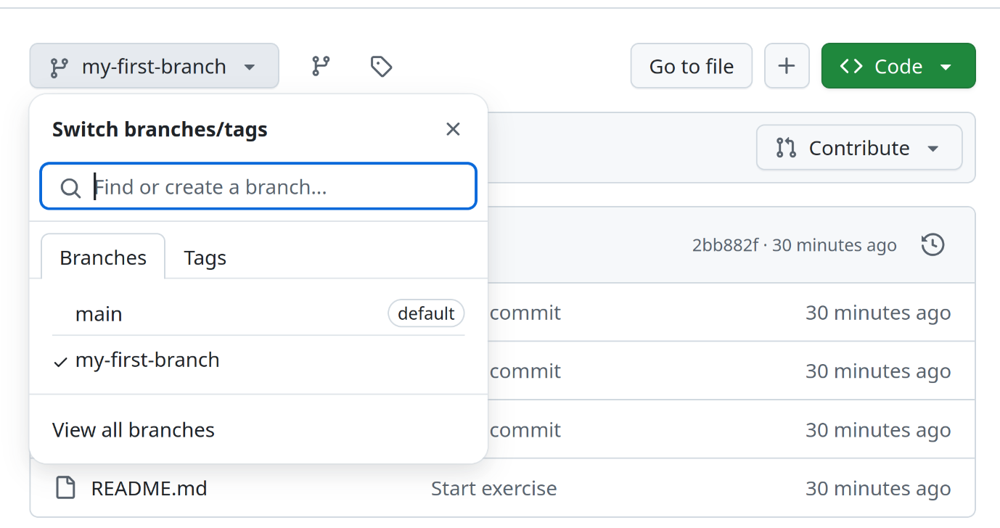

### Versionar cambios mediante IDE

En primer lugar, debemos situarnos en la pestaña de "Source Control" (el icono con tres círculos conectados) en la barra lateral izquierda. Esta nos mostrará todos los archivos con modificaciones desde el último commit al repositorio. Nos toca elegir cuales queremos versionar en el commit a realizar.

Podemos seleccionar qué archivos versionar utilizando los botones `+` individuales a la derecha de cada archivo, o clickear el botón que indica la imagen para versionar automáticamente todos los archivos que sufrieron modificaciones.

En su caso, el único archivo a versionar será `presentacion.md`.

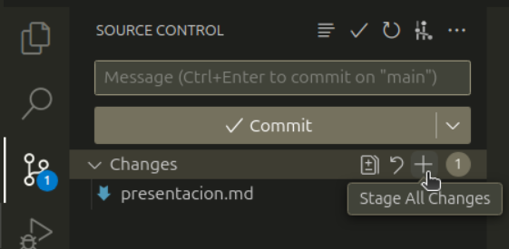

Seleccionados los archivos a versionar, podemos realizar el _commit_ de los cambios realizados. Todo _commit_ tiene asociado un _mensaje_ que describe brevemente las modificaciones que están siendo aplicadas. En este caso elegimos el mensaje `"Completo presentacion"`.

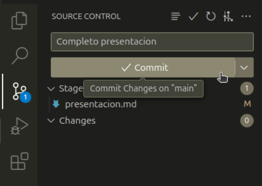

Escrito el mensaje, podemos **apretar el botón con el símbolo de tilde** :white_check_mark: para grabar el _commit_.

Así nuestros cambios han sido registrados en un commit *local* **pero aún no se han aplicado en el repositorio _remoto_.**

Se pueden realizar múltiples commits locales si se quieren ir estableciendo puntos en los que el desarrollo es estable antes de seguir avanzando (esto también facilita que los mensajes de commit sean descriptivos), de forma que si algún cambio introduce errores sea fácil deshacerlo (git provee herramientas para comparar y deshacer commits, entre muchas otras operaciones).

Finalmente hay que realizar un `push` para que **todos los commits locales pendientes impacten en el repositorio remoto**.

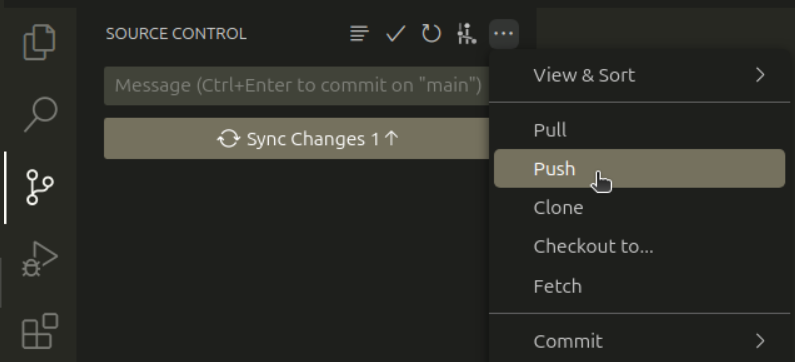

Si ahora ingresan a la página web de su repositorio, deberían poder ver su nuevo commit.


## Como hacer consultas de TP

Este TP está pensado para realizarse antes de la primer clase práctica, mientras todavía están cursando las teóricas iniciales. Por esta razón, las consultas que sean específicas de un TP y su implementación las manejaremos mediante el canal público de consultas del servidor de discord.

Las consultas de guías de ejercicio posteriores se responderán presencialmente en los horarios de laboratorio.

Para consultas administrativas de carácter privado pueden contactarnos a `orga-doc@dc.uba.ar`.

Para realizar una consulta:
1. Seleccionar el canal de consultas
2. **Utilizar el buscador de discord** para revisar si no se respondieron ya preguntas similares
3. Crear una nueva publicación con un título descriptivo (de ser relevante incluir número de guía y ejercicio)
4. Describir la consulta y en caso de tratarse de un bug, los pasos ya intentados para diagnosticar o resolver el problema.

## Entrega
La entrega se realizará mediante el campus de la materia, enviando la URL a su fork en github con el ejercicio realizado.

